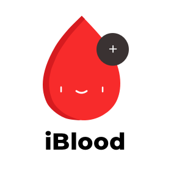
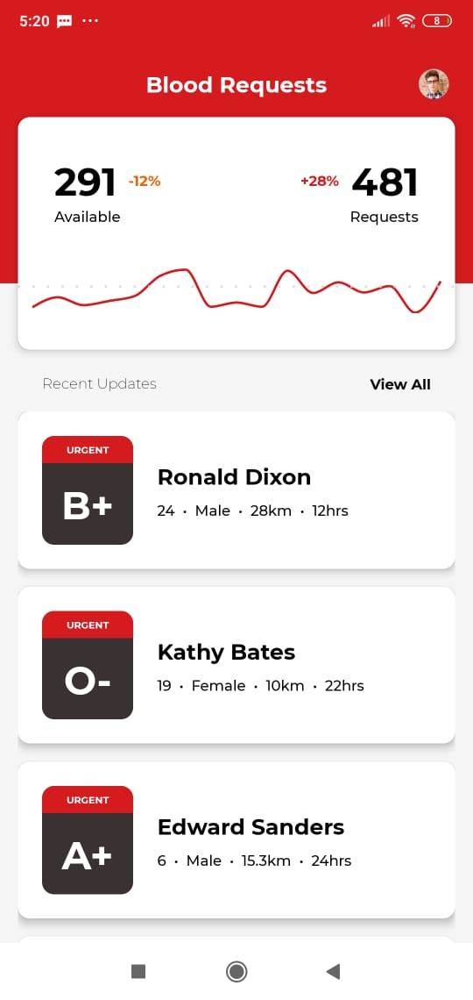

<h1 align="center">
  
</h1>
<p align="center">
  Aplicativo para doadores de sangue ficaram informados sobre as pessoas que estão precisando de doação. 
</p>

<br />

<p align="center">

</p>

## Tech
- [React Native](https://reactnative.dev) - Native Development
- [Expo](https://expo.io) - Deploy and quickly iterate on native Android, iOS, and web apps

#### 🎲 Executando o aplicativo (mobile)
```bash
# Acesse a pasta do projeto no terminal/cmd
$ cd iblood

# Instale as dependências
$ expo install

# Execute a aplicação em modo de desenvolvimento
$ expo start
```

## 🦸 Autor
<br />
<b>Alisson Moura 👋🏽 [Entre em contato!](https://www.linkedin.com/in/alisson-mo-moura/) </b><br />
<b>Design do aplicativo feito por [Kishore](https://dribbble.com/shots/5755829-Blood-Donation-App-Day-361-365-Project365)</b>


## 📝 Licença

Este projeto esta sobe a licença [MIT](./LICENSE).

